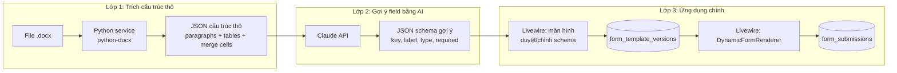

# Kiến trúc hệ thống số hóa biểu mẫu (Dynamic Form từ file Word)

## 1. Bài toán & mục tiêu

Hệ thống quản lý chất lượng (QMS) hiện có nhiều **mục tài liệu (TL)**, mỗi TL chứa một hoặc nhiều **biểu mẫu (BM)** dạng file `.docx` với cấu trúc tự do (không có Content Controls, không form field chuẩn). Mỗi ngày, người dùng cần nhập liệu vào một hoặc nhiều BM thuộc các TL khác nhau.

**Mục tiêu hệ thống:**
- Admin upload file `.docx` mẫu → hệ thống gợi ý field tự động → admin xác nhận/chỉnh sửa → lưu thành schema tái sử dụng.
- Khi biểu mẫu gốc thay đổi → cập nhật schema có versioning, không phá vỡ dữ liệu cũ.
- Người dùng nhập liệu qua form HTML render động từ schema, có validate theo đúng loại dữ liệu từng field.
- Tối ưu hóa việc theo dõi: 1 người / 1 ngày cần nhập BM nào, đã nhập hay chưa.

---

## 2. Nguyên tắc thiết kế cốt lõi

> File Word không mang metadata "field" trừ khi được đánh dấu chủ động (Content Controls). Do đó **không thể trích field 100% tự động và đáng tin cậy**. Giải pháp đúng là: đọc chính xác cấu trúc thô → gợi ý field bằng AI → con người xác nhận 1 lần/mã BM → tái sử dụng vĩnh viễn.

Từ đó hệ thống tách làm 3 lớp độc lập:



---

## 3. Thành phần hệ thống

### 3.1. Laravel + Livewire (ứng dụng chính)
Vai trò "nhạc trưởng": quản lý auth, TL/BM, upload file, gọi 2 service ngoài, lưu schema, render form, validate, lưu dữ liệu nhập, báo cáo/thống kê.

### 3.2. Python extraction service (đọc cấu trúc thô)
- Framework: **FastAPI** (nhẹ, async, dễ deploy riêng).
- Thư viện lõi: **python-docx** — đọc chính xác paragraph, run, table, ô bị merge (`gridSpan`, `vMerge`).
- Chỉ 1 nhiệm vụ duy nhất: nhận file `.docx` → trả JSON mô tả cấu trúc **thật sự có trong file** (không suy đoán, không AI).
- Chạy độc lập, Laravel gọi qua HTTP nội bộ.

Ví dụ response:
```json
{
  "paragraphs": [
    {"index": 3, "text": "Họ và tên: Vũ Thị Hường     Chức vụ: Senior Sale Exclutive"}
  ],
  "tables": [
    {
      "index": 1,
      "rows": 8,
      "cols": 14,
      "cells": [
        {"row": 0, "col": 0, "text": "TT", "grid_span": 1, "v_merge": null},
        {"row": 0, "col": 10, "text": "Đánh giá", "grid_span": 3, "v_merge": null}
      ]
    }
  ]
}
```

### 3.3. Claude API (gợi ý schema)
- Nhận JSON thô từ 3.2 kèm prompt mô tả bài toán (biểu mẫu y tế tiếng Việt) → trả về JSON schema field đề xuất.
- Chỉ là **gợi ý**, không tự động lưu — luôn qua bước admin duyệt.

Schema field chuẩn hóa (dùng chung cho toàn hệ thống):
```json
{
  "ma_bm": "BM_02_QTQL_29_1_19",
  "version": 1,
  "fields": [
    {
      "key": "ben_giao_ho_ten",
      "label": "Họ và tên (bên giao)",
      "type": "text",
      "required": true
    },
    {
      "key": "ngay_lap",
      "label": "Ngày lập biên bản",
      "type": "date",
      "required": true
    },
    {
      "key": "danh_sach_vat_tu",
      "label": "Danh sách vật tư",
      "type": "repeatable_table",
      "columns": [
        {"key": "ten_vat_tu", "label": "Tên vật tư", "type": "text"},
        {"key": "so_lot", "label": "Số lot", "type": "text"},
        {"key": "han_su_dung", "label": "Hạn sử dụng", "type": "date"},
        {"key": "danh_gia", "label": "Đánh giá", "type": "select", "options": ["Đạt", "Không đạt"]}
      ]
    }
  ]
}
```

Các `type` hỗ trợ: `text`, `textarea`, `number`, `date`, `select`, `radio`, `checkbox`, `repeatable_table`.

---

## 4. Thiết kế cơ sở dữ liệu (Laravel migrations)

```
document_categories        (TL - mục tài liệu)
├─ id
├─ ten_muc
└─ mo_ta

form_templates              (BM - biểu mẫu)
├─ id
├─ document_category_id  (FK)
├─ ma_bm                  ("BM_02_QTQL_29_1_19")
├─ ten_bm
├─ file_goc_path
└─ trang_thai              (draft / active / archived)

form_template_versions      (schema đã được duyệt, có version)
├─ id
├─ form_template_id  (FK)
├─ version            (1, 2, 3...)
├─ schema_json
├─ duyet_boi          (user_id admin)
└─ created_at

form_submissions             (1 lần nhập liệu của 1 người, 1 ngày, 1 BM)
├─ id
├─ form_template_version_id  (FK — luôn trỏ đúng version tại thời điểm nhập)
├─ user_id
├─ ngay_nhap
├─ data_json           (giá trị các field dạng text/date/select...)
└─ trang_thai           (nhap_dang_do / hoan_thanh)

form_submission_rows          (dữ liệu field dạng repeatable_table)
├─ id
├─ form_submission_id  (FK)
├─ field_key            ("danh_sach_vat_tu")
├─ row_index
└─ row_data_json
```

**Vì sao tách `form_submission_rows` riêng thay vì nhét hết vào `data_json`?**
Vì sổ nhật ký (BM_01_QTQL_28) có bảng lặp lại hàng trăm dòng theo thời gian — tách bảng riêng giúp query/thống kê theo dòng (ví dụ: đếm số lần "Không đạt" trong tháng) dễ hơn nhiều so với query trong JSON lồng nhau.

---

## 5. Luồng nghiệp vụ

### 5.1. Admin tạo/cập nhật biểu mẫu
1. Chọn TL → upload file `.docx` mới, đặt mã BM.
2. Laravel gửi file sang Python service → nhận JSON thô.
3. Laravel gửi JSON thô sang Claude API → nhận schema gợi ý.
4. Livewire hiển thị bảng field gợi ý, admin sửa: đổi label, đổi type, thêm/xóa field, đặt required.
5. Admin bấm "Xuất bản" → lưu `form_template_versions` (version mới).
6. Nếu là cập nhật file cho BM đã tồn tại → hệ thống **diff** field cũ/mới, cảnh báo field bị xóa (ảnh hưởng submission cũ), admin xác nhận trước khi lưu version mới.

### 5.2. Người dùng nhập liệu hàng ngày
1. Trang chủ hiển thị theo TL → danh sách BM cần nhập hôm nay (có thể có bảng `daily_checklist` để nhắc việc).
2. Chọn BM → Livewire load `form_template_versions` mới nhất → render `DynamicFormRenderer`.
3. Nhập liệu → validate động theo `type` từng field (rule Laravel build runtime).
4. Lưu → tạo/cập nhật `form_submissions` + `form_submission_rows`.
5. Có thể xuất lại file `.docx` đã điền (dùng PHPWord ghi giá trị vào template gốc) để lưu trữ/in.

---

## 6. Validate dữ liệu theo loại field

Laravel build rule động từ schema thay vì viết cứng cho từng BM:

```php
function buildValidationRules(array $fields): array
{
    $rules = [];
    foreach ($fields as $field) {
        $rule = match ($field['type']) {
            'text', 'textarea' => 'string',
            'number'            => 'numeric',
            'date'              => 'date',
            'select', 'radio'   => 'in:' . implode(',', $field['options'] ?? []),
            'checkbox'          => 'boolean',
            'repeatable_table'  => 'array',
            default             => 'nullable',
        };
        $rules['data.' . $field['key']] = ($field['required'] ? 'required|' : 'nullable|') . $rule;
    }
    return $rules;
}
```

---

## 7. Triển khai / Hosting

| Thành phần | Công nghệ | Ghi chú deploy |
|---|---|---|
| App chính | Laravel + Livewire | VPS hoặc hosting hỗ trợ PHP 8.2+, cần chạy được queue worker |
| Extraction service | Python (FastAPI + python-docx) | Chạy như service riêng (systemd/Docker), Laravel gọi qua `http://127.0.0.1:8001` |
| AI schema suggestion | Claude API | Gọi trực tiếp từ Laravel qua HTTP, không cần host riêng |
| Queue | Laravel Queue (database hoặc Redis driver) | Xử lý bất đồng bộ bước upload → extract → suggest (tránh timeout HTTP) |
| Lưu file | Laravel Storage (local hoặc S3-compatible) | Lưu file `.docx` gốc để tái sử dụng khi export lại |

**Yêu cầu hosting bắt buộc:**
- Hosting phải cho phép chạy **process nền độc lập** (Python service) — không hoạt động trên shared hosting cPanel giá rẻ chặn `exec`/không cho mở port riêng.
- Nên dùng **VPS** (DigitalOcean, Vultr, AWS EC2, hoặc VPS trong nước) triển khai bằng Docker Compose gồm 2 container: `laravel-app` và `python-extract-service`, dùng network nội bộ giữa 2 container, không public port Python ra ngoài.

```yaml
# docker-compose.yml (minh họa)
services:
  app:
    build: ./laravel
    ports: ["80:80"]
    depends_on: [extract-service]
  extract-service:
    build: ./python-service
    expose: ["8001"]   # chỉ nội bộ, không public
```

---

## 8. Lộ trình triển khai đề xuất

| Giai đoạn | Nội dung |
|---|---|
| **Phase 1** | Xây migration DB, CRUD TL/BM cơ bản, upload file, lưu trữ |
| **Phase 2** | Python extraction service (đọc thô, chưa cần AI) + hiển thị JSON thô ra Livewire để kiểm chứng |
| **Phase 3** | Tích hợp Claude API gợi ý schema + màn hình admin duyệt/chỉnh field |
| **Phase 4** | `DynamicFormRenderer` cho người dùng nhập liệu + validate động |
| **Phase 5** | Versioning schema + diff khi cập nhật BM + export lại `.docx` đã điền |
| **Phase 6** | Dashboard nhắc việc theo TL/BM/ngày, báo cáo thống kê (ví dụ tỷ lệ Đạt/Không đạt nội kiểm theo tháng) |

---

## 9. Rủi ro cần lưu ý

- **AI gợi ý sai field** với form quá phức tạp/viết tắt nhiều → luôn giữ bước admin duyệt, không auto-publish schema.
- **Cập nhật BM làm đổi field key** → cần chính sách rõ: field bị xóa thì submission cũ vẫn giữ nguyên (đọc theo version cũ), không migrate dữ liệu ngược.
- **Bảng lặp nhiều (sổ nhật ký)** có thể phình rất lớn theo thời gian → nên tính toán phân trang/lọc theo tháng ngay từ đầu ở `form_submission_rows`, tránh load hết 1 lần.
